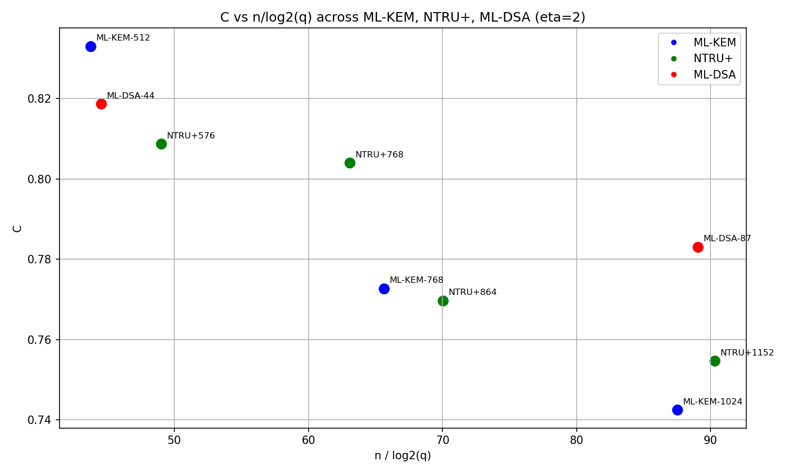

# Results

실험 환경: SageMath + lattice-estimator 0.1.0

## 중요: 분석 방법 차이

| 방법 | 특징 |
|---|---|
| `LWE.dual_hybrid` | MATZOV cost model, 낙관적 추정 |
| `dual_hybrid` 직접 호출 | 보수적 추정, 더 정확 |

초기 실험은 `LWE.dual_hybrid` 사용. 이후 `dual_hybrid` 직접 호출로 재실험.
**`all_security_revised.txt`가 정확한 결과.**

---

## 파일 목록

| 파일 | 내용 | 방법 |
|---|---|---|
| all_security_revised.txt | ML-KEM/DSA/NTRU+ 전체 revised 결과 | dual_hybrid 직접 |
| mlkem_security.txt | ML-KEM 초기 결과 | LWE.dual_hybrid |
| mldsa_security.txt | ML-DSA 초기 결과 | LWE.dual_hybrid |
| ntruplus_security.txt | NTRU+ 초기 결과 | LWE.dual_hybrid |
| sparse_secret.txt | ML-KEM-768 sparse secret 분석 | LWE.dual_hybrid |
| zeta_search.txt | n=600~900 ζ 탐색 | LWE.dual_hybrid |
| zeta_eta.txt | η 변화에 따른 ζ | LWE.dual_hybrid |
| zeta_n_eta.txt | n=512 η 변화 | LWE.dual_hybrid |
| zeta_pattern.txt | n=500~1060 ζ 패턴 | dual_hybrid 직접 |
| mlkem_zeta_plot.png | ML-KEM ζ 그래프 | — |
| zeta_boundary_plot.png | DSA ζ 경계 그래프 | — |

---

## 핵심 결과 (Revised)

### Primal vs Dual 비교

| 표준 | 파라미터셋 | Primal | Dual | 차이 |
|---|---|---|---|---|
| ML-KEM | 512 | 143.8 | 145.5 | primal 유리 |
| ML-KEM | 768 | 204.9 | 206.4 | primal 유리 |
| ML-KEM | 1024 | 275.1 | 277.5 | primal 유리 |
| ML-DSA | 44 | 143.5 | 144.3 | primal 유리 |
| ML-DSA | 65 | 231.3 | 233.9 | primal 유리 |
| ML-DSA | 87 | 302.4 | 304.2 | primal 유리 |
| NTRU+ | 576 | 153.1 | 153.9 | primal 유리 |
| NTRU+ | 768 | 197.7 | 199.1 | primal 유리 |
| NTRU+ | 864 | 220.0 | 221.8 | primal 유리 |
| NTRU+ | 1152 | 287.7 | 290.2 | primal 유리 |

→ 정확한 cost model에서는 세 표준 모두 primal이 dual보다 효율적.

### ζ 패턴

정확한 결과에서 ζ는 n에 비례해서 증가하는 경향:
- ζ ≈ 0.041 × n (q=3329, η=2 기준)

### 초기 결과와의 차이

초기 결과(LWE.dual_hybrid)에서 "dual이 primal보다 효율적"이라는 결론은
MATZOV cost model의 낙관적 추정 때문이었음.
더 정확한 방법으로 재실험 결과 primal이 전반적으로 효율적.

## 향후 실험

- [ ] sparse secret 분석 재실험 (dual_hybrid 직접 호출)
- [ ] ζ ≈ 0.041 × n 관계 수식화
- [ ] q/n 비율과 ζ 관계 분석
## ζ 경험적 공식 (Empirical Formula)

실험을 통해 도출한 ζ_optimal 경험적 공식:

> **ζ_optimal ≈ 0.8 × n / (log2(q) × log2(η+1))**

| 파일 | 내용 |
|---|---|
| zeta_qn.txt | 실제 표준 파라미터 ζ/n 비율 |
| zeta_formula.txt | C 역산 결과 |

**검증 결과:**
- ML-KEM, NTRU+: C ≈ 0.74~0.91
- ML-DSA: C ≈ 0.78~0.87
- n이 커질수록 C가 0.8에 수렴

**미해결 문제:**
- C가 완전히 일정하지 않은 이유
- 공식의 수학적 증명
- η, q 외 다른 변수의 영향
## ζ 경험적 공식 추가 분석

### n/log2(q) vs C 관계

세 표준의 파라미터를 n/log2(q)로 정규화하면 C값이
하나의 단조 감소 곡선으로 수렴함.

| 파일 | 내용 |
|---|---|
| zeta_nlogq.txt | n/log2(q) vs C 데이터 |
| zeta_eta1.txt | eta=1 구간 분석 |
| zeta_C_eta.txt | C(eta) 선형 근사 검증 |
| zeta_sqrt.txt | C/sqrt(eta) 패턴 분석 |
| zeta_q_continuous.txt | q 연속 변화에 따른 C |
| zeta_n_convergence.txt | n 증가에 따른 C 수렴 |
| C_vs_nlogq.png | C vs n/log2(q) 그래프 |

### 미해결 문제

- C(η)의 정확한 함수 형태 (선형/로그/제곱근 근사 모두 불완전)
- n/log2(q)와 C의 정확한 관계식 수식화
- 공식의 수학적 증명
## 최종 경험적 공식

> **ζ_optimal ≈ (-0.076 + 0.701 × η^0.2) × n / (log2(q) × log2(η+1))**

### 검증 결과

| 범위 | 파라미터셋 수 | max_err | avg_err |
|---|---|---|---|
| η≥2, n≥512 | 17개 | 4 | 2.53 |
| η=1, n≥512 | 8개 | 6 | 3.50 |
| η=1, n≥1024 | 4개 | 3 | 2.00 |

### 유효 범위

- n≥512, η≥1, q=3000~8380417
- n≥1024일 때 오차 ±4 이내
- n<512는 오차 커서 공식 적용 어려움

### 추가 파일

| 파일 | 내용 |
|---|---|
| zeta_fitting.txt | C(eta) 지수 α 최소제곱법 탐색 |
| zeta_verify2.txt | 최종 공식 검증 (10개 파라미터셋) |
| zeta_C_nlogq2.txt | n/log2(q) vs C 피팅 |
| zeta_verify3.txt | 확장 검증 (17개 파라미터셋) |
| zeta_eta1_analysis.txt | eta=1 구간 분석 |

### 미해결 문제

- η^0.2 지수의 수학적 의미
- C와 n/log2(q)의 정확한 관계식
- n<512 구간에서 공식이 불안정한 이유
- 공식의 수학적 증명
